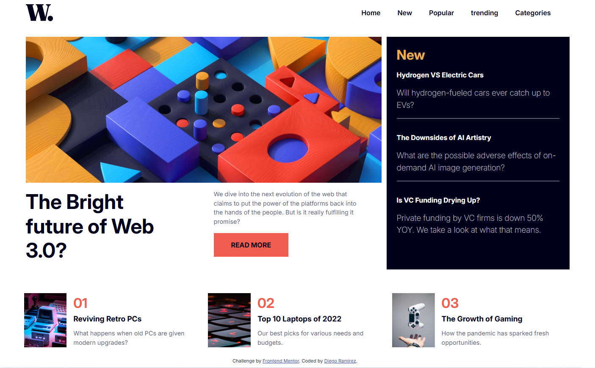

# Frontend Mentor - News homepage solution

This is a solution to the [News homepage challenge on Frontend Mentor](https://www.frontendmentor.io/challenges/news-homepage-H6SWTa1MFl). Frontend Mentor challenges help you improve your coding skills by building realistic projects. 

## Table of contents

- [Overview](#overview)
  - [The challenge](#the-challenge)
  - [Screenshot](#screenshot)
  - [Links](#links)
- [My process](#my-process)
  - [Built with](#built-with)
  - [What I learned](#what-i-learned)
  - [Continued development](#continued-development)
- [Author](#author)

## Overview

### The challenge

Users should be able to:

- View the optimal layout for the interface depending on their device's screen size
- See hover and focus states for all interactive elements on the page

### Screenshot



### Links

- Solution URL: [Solution URL](https://github.com/Diego2Drm/news-homepage)
- Live Site URL: [Live site URL](https://news-homepage-main-diego-2d.netlify.app/)

## My process

### Built with

- Semantic HTML5 markup
- CSS custom properties
- Flexbox
- CSS Grid
- [Bootstrap 5](https://getbootstrap.com/) - Css Framework
- [Sass](https://sass-lang.com/) - CSS Sass preprocessor 
- [React](https://reactjs.org/) - JS library

### What I learned

I learned use Bootstrap and Sass with React js 

Nav responsive with Bootstrap 5

```html
      <nav className="navbar navbar-expand-lg">
        <div className="container-fluid">
          
          <button className="d-lg-none" type="button" data-bs-toggle="offcanvas" data-bs-target="#offcanvasNavbar" aria-controls="offcanvasNavbar" aria-label="Toggle navigation">
            
          </button>
          <div className="offcanvas offcanvas-end" tabIndex="-1" id="offcanvasNavbar" aria-labelledby="offcanvasNavbarLabel" >
            <div className="offcanvas-header d-flex justify-content-end d-lg-none">
              <button type="button" data-bs-dismiss="offcanvas" aria-label="Close">
                
              </button>
            </div>
            <div className="offcanvas-body">
              <ul className="navbar-nav justify-content-end flex-grow-1 ps-3 pe-lg-4 mt-4 mt-lg-0 gap-4 fw-semibold" >
                <li className="nav-item">
                  <a className="nav-link" href="#">Home</a>
                </li>
                <li className="nav-item">
                  <a className="nav-link" href="#">New</a>
                </li>
                <li className="nav-item">
                  <a className="nav-link" href="#">Popular</a>
                </li>
                <li className="nav-item">
                  <a className="nav-link" href="#">trending</a>
                </li>
                <li className="nav-item">
                  <a className="nav-link" href="#">Categories</a>
                </li>
              </ul>
            </div>
          </div>
        </div>
      </nav>
```

### Continued development

- Bootstrap 5
- Sass
- React js

## Author

- Frontend Mentor - [@Diego2Drm](https://www.frontendmentor.io/profile/Diego2Drm)

